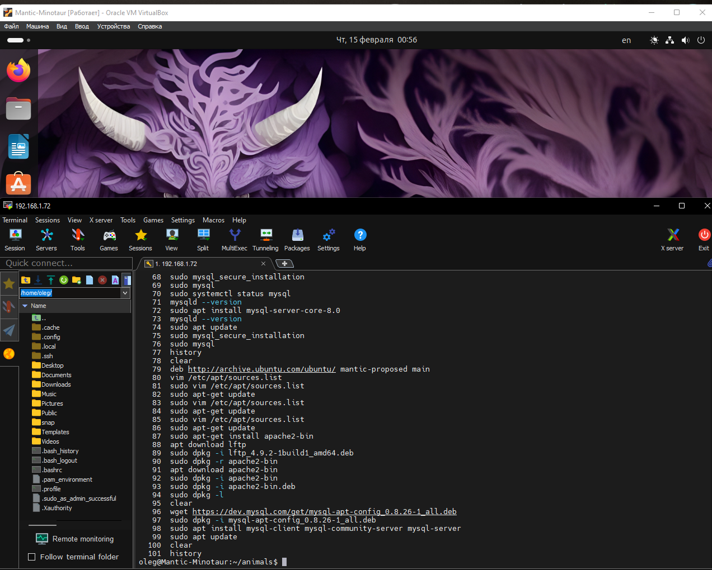

# Азарных Олег Вячеславович, 15.02.2024,

# Разработчик — Программист. Специализация
***
***
***
# Операционные системы и виртуализация (Linux)

## Использование команды cat в Linux

* Создать два текстовых файла: "Pets"(Домашние животные) и "Pack
  animals"(вьючные животные), используя команду `cat` в терминале Linux. В
  первом файле перечислить собак, кошек и хомяков. Во втором — лошадей,
  верблюдов и ослов.

```
oleg@Mantic-Minotaur:~$ cat > Pets
собаки
кошки
хомяки
oleg@Mantic-Minotaur:~$ cat > Pack_animals
лошади
верблюды
ослы
```

* Объединить содержимое этих двух файлов в один и просмотреть его
  содержимое.

```
oleg@Mantic-Minotaur:~$ cat Pets Pack_animals > Animals
oleg@Mantic-Minotaur:~$ cat Animals
собаки
кошки
хомяки
лошади
верблюды
ослы
```

* Переименовать получившийся файл в "Human Friends".

```
oleg@Mantic-Minotaur:~$ mv Animals Human_Friends
```
## Работа с директориями в Linux

- Создать новую директорию и переместить туда файл "Human Friends".

```
oleg@Mantic-Minotaur:~$ mkdir animals
oleg@Mantic-Minotaur:~$ mv Human_Friends animals
oleg@Mantic-Minotaur:~$ ls
animals  Desktop  Documents  Downloads  Music  Pictures  Public  snap  Templates  Videos
oleg@Mantic-Minotaur:~$ cd animals
oleg@Mantic-Minotaur:~/animals$ ls
Human_Friends
```
## Работа с MySQL в Linux.

- Установить MySQL на вашу вычислительную машину

- Подключить дополнительный репозиторий MySQL и установить один из
  пакетов из этого репозитория.

```
oleg@Mantic-Minotaur:\~/animals\$ wget https://dev.mysql.com/get/mysql-apt-config\_0.8.26-1\_all.deb
oleg@Mantic-Minotaur:\~/animals\$  sudo dpkg -i mysql-apt-config\_0.8.26-1\_all.deb
oleg@Mantic-Minotaur:\~/animals\$  sudo apt install mysql-client mysql-community-server mysql-server
oleg@Mantic-Minotaur:\~/animals\$ sudo apt update
oleg@Mantic-Minotaur:\~/animals\$  sudo apt-key adv --keyserver hkp://keyserver.ubuntu.com:80 --recv-keys 6494C6D6997C215E
oleg@Mantic-Minotaur:\~/animals\$  sudo apt install mysql-client mysql-community-server mysql-server
oleg@Mantic-Minotaur:\~/animals\$  sudo apt-key del A4A9 4068 76FC BD3C 4567  70C8 8C71 8D3B 5072 E1F5
oleg@Mantic-Minotaur:\~/animals\$  sudo apt-key del 859B E8D7 C586 F538 430B  19C2 467B 942D 3A79 BD29
oleg@Mantic-Minotaur:\~/animals\$  gpg --keyserver keyserver.ubuntu.com --recv B7B3B788A8D3785C
oleg@Mantic-Minotaur:\~/animals\$  gpg --export B7B3B788A8D3785C | sudo tee /etc/apt/trusted.gpg.d/mysql.gpg > /dev/null
oleg@Mantic-Minotaur:\~/animals\$  sudo vim /etc/apt/sources.list.d/mysql.list
oleg@Mantic-Minotaur:\~/animals\$  sudo apt update
oleg@Mantic-Minotaur:\~/animals\$  sudo apt upgrade
oleg@Mantic-Minotaur:\~/animals\$  sudo apt install mysql-server-core-8.0
oleg@Mantic-Minotaur:\~/animals\$  mysqld --version
```


## Управление deb-пакетами

- Установить и затем удалить deb-пакет, используя команду `dpkg`.

```
oleg@Mantic-Minotaur:~/animals$ sudo vim /etc/apt/sources.list
[sudo] password for oleg:
oleg@Mantic-Minotaur:~/animals$ sudo apt-get update
      Get:1 http://archive.ubuntu.com/ubuntu mantic-proposed InRelease [256 kB]
      Hit:2 http://ru.archive.ubuntu.com/ubuntu mantic InRelease
      Hit:3 http://ru.archive.ubuntu.com/ubuntu mantic-updates InRelease
      .......
oleg@Mantic-Minotaur:~/animals$ apt download apache2-bin
oleg@Mantic-Minotaur:~/animals$ sudo apt-get install apache2-bin
      Reading package lists... Done
      Building dependency tree... Done
      Reading state information... Done
      .....
oleg@Mantic-Minotaur:~/animals$ sudo dpkg -r apache2-bin
```

## История команд в терминале Ubuntu

- Сохранить и выложить историю ваших терминальных команд в Ubuntu.
  В формате: Файла с ФИО, датой сдачи, номером группы(или потока)

